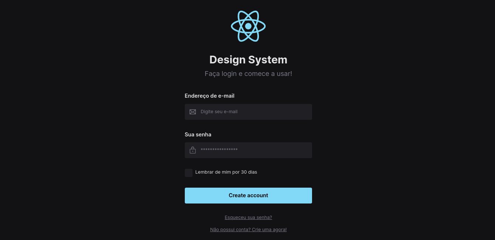
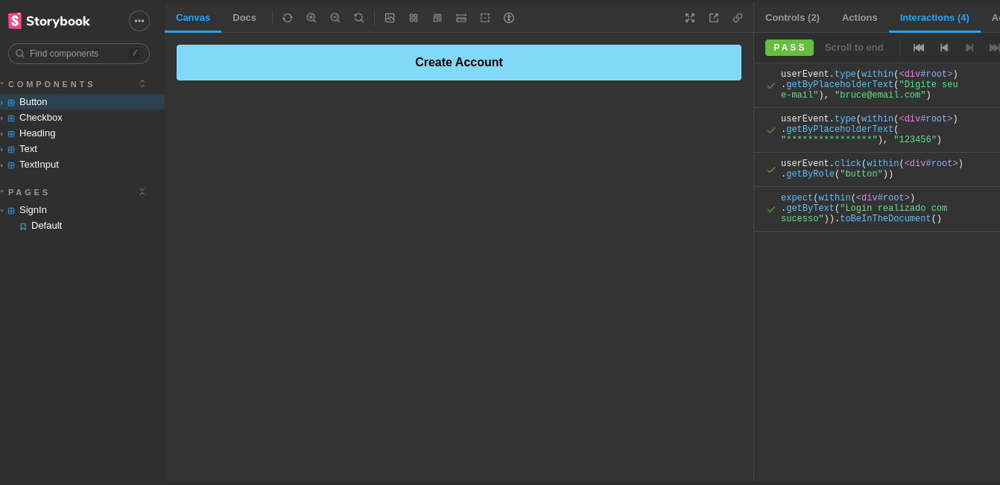

<h1 align="center">
   Design System
</h1>

# Screens




## Technologies used

- [React](https://pt-br.reactjs.org/)
- [Vite](https://vitejs.dev/)
- [Typescript](https://www.typescriptlang.org)
- [Tailwindcss](https://tailwindcss.com/)
- [Storybook](https://storybook.js.org/)
- [Radix](https://www.radix-ui.com/)
- [Jest](https://jestjs.io/pt-BR/)
- [CI/CD](https://github.blog/2022-02-02-build-ci-cd-pipeline-github-actions-four-steps/)

## Projeto:

Design System: componentes e suas variações no Figma, e em seguida implementados no código, utilizando o React e a ferramenta Storybook para a documentação dos componentes

## Requirements

You need to install both [Node.js](https://nodejs.org) and [Yarn](https://yarnpkg.com) or npm to run this project.

## How to use it

```bash
  # Install the dependencies
  $ yarn install
  # Run the web server
  $ yarn dev
  # Run storybook server
  $ yarn storybook
```

The app will be available for access on your browser at (http://localhost)
